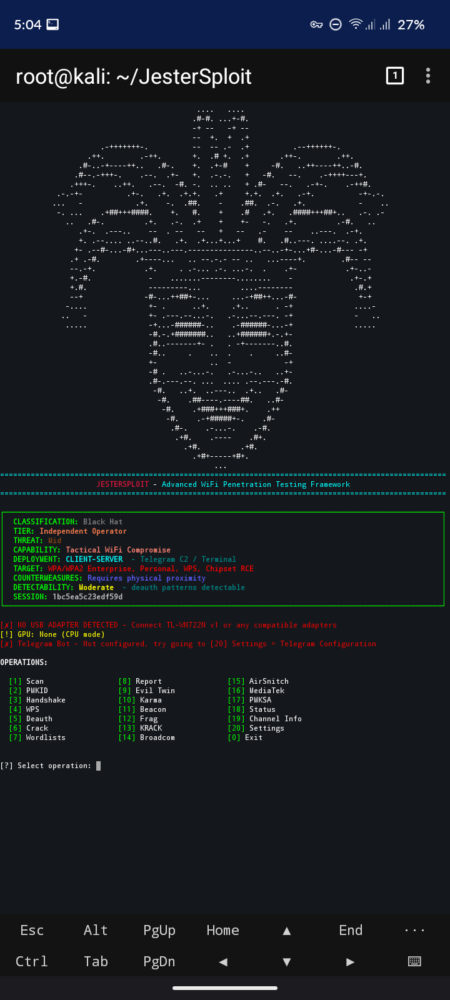

# JesterSploit – The FIRST JesterSploit's WiFi Penetration Testing Framework

[](https://opensource.org/licenses/MIT)

**JesterSploit** is the first JesterSploit's modular WiFi penetration testing framework designed for flexibility, stability, and extensibility. It includes multiple attack modules (PMKID, handshake capture, WPS, deauth, evil twin, KRACK, FragAttacks, and more), with a clean CLI interface, logging system, and hardware-aware execution.

---

## ⚠️ Disclaimer

> This tool is intended **only for authorized security assessments** on networks you own or have explicit permission to test. Unauthorized use is illegal. The authors assume no liability for misuse.

---

## Features

- **USB adapter detection** – prioritizes external adapters for reliability  
- **Multiple attack modules** – PMKID, handshake capture, WPS, deauth, evil twin, karma, beacon flood, FragAttacks, KRACK  
- **Fallback execution mode** – runs even without compatible hardware (simulation mode)  
- **Modular architecture** – easily extendable via `core` modules  
- **Separated logging system** – attack, bug, and engine logs  
- **Threaded task engine** – supports parallel execution  
- **GPU-aware cracking support** – integrates with hashcat if available  
- **Clean CLI interface** – structured and interactive menu system  

---


## 📡 Adapter Compatibility Deep Dive

> Compatibility depends on **chipset support (monitor mode + packet injection)**, not just the adapter brand.

---

### ✅ Fully Supported Adapters (Recommended)

These adapters are **confirmed to work reliably** with monitor mode and packet injection:

| Adapter | Chipset | Status | Notes |
|---------|---------|--------|-------|
| Alfa AWUS036NHA | Atheros AR9271 | ✅ Fully supported | Native Linux driver, stable injection |
| Alfa AWUS036NH | Ralink RT3070 | ✅ Supported | Reliable injection and monitoring |
| Alfa AWUS051NH | Ralink RT5572 | ✅ Supported | Dual-band support with stable injection |
| Alfa AWUS036ACM | MediaTek MT7612U | ✅ Fully supported | Modern chipset with strong Linux driver support |
| Alfa AWUS036NEH | Ralink RT3070 | ✅ Supported | Legacy adapter but still stable |
| TP-Link TL-WN722N v1 | Atheros AR9271 | ✅ Fully supported | One of the most stable adapters for pentesting |
| Panda PAU05 | Ralink RT3070 | ✅ Supported | Small form factor with reliable injection |
| Panda PAU06 | Ralink RT5372 | ✅ Supported | Good compatibility with Kali/Linux |

---

### ⚠️ Partially Supported (Driver Dependent)

These may work, but can be **unstable or require manual drivers**:

| Adapter | Chipset | Status | Issues |
|---------|---------|--------|--------|
| Alfa AWUS036ACH | Realtek RTL8812AU | ⚠️ Partial | Driver instability, injection inconsistent |
| Alfa AWUS1900 | Realtek RTL8814AU | ⚠️ Partial | Requires patched drivers, unstable performance |
| ASUS USB-AC68 | Realtek RTL8814AU | ⚠️ Partial | Works with drivers, but inconsistent injection |
| TP-Link Archer T2U Plus | Realtek RTL8812BU / RTL8821AU | ⚠️ Limited | Weak monitor mode, unreliable injection |
| Panda PAU09 | Ralink RT5572 | ⚠️ Mixed | Works, but depends on driver version |
| ZyXEL NWD6605 | Realtek RTL8812AU | ⚠️ Partial | Requires external drivers |
| BrosTrend AC1200 | RTL8812AU / RTL8812BU | ⚠️ Partial | Driver dependent |

---

### ❌ Not Supported (Will NOT Work Properly)

These adapters **do not support proper packet injection** or are unstable:

| Adapter | Chipset | Reason |
|---------|---------|--------|
| TP-Link TL-WN722N v2 / v3 | Realtek RTL8188EUS | No reliable injection, unstable monitor mode |
| TP-Link TL-WN823N | Realtek RTL8192EU | Injection fails, poor driver support |
| TP-Link TL-WN822N | Realtek RTL8192CU | Weak or non-functional injection |
| D-Link DWA-131 | Realtek RTL8192CU | No packet injection |
| Edimax EW-7811Un | Realtek RTL8188CUS | Limited to basic WiFi usage |
| Netis WF2123 | Realtek RTL8192CU | Injection unreliable |
| Generic Nano USB Adapters | RTL8188CUS / RTL8192CU | Designed for basic connectivity only |

---

### ❌ Internal WiFi Cards (Not Used)

These are **intentionally ignored** by JesterSploit:

| Chipset Family | Status | Reason |
|----------------|--------|--------|
| Intel Wireless (ALL models) | ❌ Not supported | No packet injection support |
| Broadcom Internal Cards | ❌ Not supported | Limited monitor mode, no injection |

---

## 💰 Budget-Friendly Adapter Guide (Under $25)

Looking for an affordable adapter that actually works? Here are your best options:

---

### ✅ Top Budget Picks (Fully Supported)

| Adapter | Chipset | Price Range | Where to Buy | Notes |
|---------|---------|-------------|--------------|-------|
| **TP-Link TL-WN722N v1** | Atheros AR9271 | $12–18 | Amazon, eBay, AliExpress | **Most popular** – must be v1 (v2/v3 are broken). Check the box! |
| **Panda PAU05** | Ralink RT3070 | $15–20 | Amazon, eBay | Tiny form factor, reliable plug-and-play |
| **Panda PAU06** | Ralink RT5372 | $18–25 | Amazon | Slightly newer chipset, very stable |
| **Generic AR9271** | Atheros AR9271 | $8–15 | AliExpress, eBay | Same chipset as TL-WN722N v1. Check seller ratings before buying |
| **Generic RT3070** | Ralink RT3070 | $8–12 | AliExpress | Cheap, but quality control varies. Look for "RT3070" in description |

---

### 📦 Where to Find Them

| Adapter | Amazon | eBay | AliExpress |
|---------|--------|------|------------|
| TP-Link TL-WN722N v1 | ✅ Search "TL-WN722N v1" | ✅ Used units available | ⚠️ Verify v1 with seller |
| Panda PAU05 | ✅ Direct search | ✅ Occasionally | ❌ Rare |
| Panda PAU06 | ✅ Direct search | ✅ Occasionally | ❌ Rare |
| Generic AR9271 | ❌ | ✅ Search "AR9271 USB WiFi" | ✅ Best source ($8–15) |
| Generic RT3070 | ❌ | ✅ Search "RT3070 USB WiFi" | ✅ Best source ($8–12) |

---

### ⚠️ What to Watch Out For

- **TL-WN722N v2/v3** – looks identical but uses Realtek chipset that **does not work**
- **Generic nano adapters** – often use RTL8188CUS, **no packet injection**
- **"600Mbps" adapters** – usually Realtek, unstable
- **No-brand adapters** – ask the seller for the chipset before buying

---

### 🛡️ How to Verify You're Getting the Right One

#### For TP-Link TL-WN722N v1:
- The box **does not** say "v2" or "v3"
- The adapter has **removable antenna**
- Chipset is **Atheros AR9271**

#### For Generic AR9271:
- Look for listing that explicitly says "AR9271"
- Avoid listings that only say "1200Mbps" or "USB WiFi"
- Ask the seller: "What chipset does this use?"

#### For RT3070/RT5372:
- Look for "RT3070" or "RT5372" in the title
- Common brands: Panda, Alfa, or unbranded

---

### 🏆 Best Value Recommendations

| If You Want... | Best Option | Price | Why |
|----------------|-------------|-------|-----|
| **The most reliable budget pick** | TP-Link TL-WN722N v1 | $12–18 | Proven track record, native Linux support |
| **The smallest form factor** | Panda PAU05 | $15–20 | Fits anywhere, reliable RT3070 |
| **The absolute cheapest** | Generic AR9271 | $8–15 | Same chipset as TL-WN722N v1, riskier quality |
| **The newest budget chip** | Panda PAU06 | $18–25 | RT5372, slightly better range |

---

### 💡 Pro Tips

- **Buy from Amazon/eBay with buyer protection** – if it's the wrong version, return it
- **AliExpress is cheaper but slower** – use trusted sellers with high ratings
- **Used TL-WN722N v1 on eBay** – often $10–12, good value
- **Avoid bundles** – they often include the broken v2/v3 version

---

### 📝 Quick Checklist Before Buying

- [ ] Chipset is **Atheros AR9271**, **Ralink RT3070**, or **Ralink RT5372**
- [ ] If buying TP-Link, ensure it's **v1** (not v2/v3)
- [ ] Adapter supports **monitor mode** and **packet injection**
- [ ] Seller confirms chipset if not listed
- [ ] Price under $25

---

### ❌ Budget Adapters to Avoid at Any Price

| Adapter | Why to Avoid |
|---------|--------------|
| TP-Link TL-WN722N v2/v3 | Realtek chipset, no injection |
| Generic nano adapters | RTL8188CUS – basic WiFi only |
| TP-Link TL-WN823N | Injection fails consistently |
| D-Link DWA-131 | No packet injection |
| Edimax EW-7811Un | No monitor mode/injection |

---

## 🧠 Important Notes

- Monitor mode alone is **NOT enough** — packet injection is required for most attacks  
- Realtek adapters often require **custom drivers** and may still fail  
- Adapter version matters (e.g., TL-WN722N v1 works, v2/v3 do not)  
- For best performance, use **Atheros or MediaTek-based adapters**  

---

## ⚡ Recommendation

> For full JesterSploit functionality, use:
> 
> - Alfa AWUS036NHA  
> - Alfa AWUS036ACM  
> - TP-Link TL-WN722N v1  
> - Panda PAU05 / PAU06

---

## Installation

### Prerequisites
 
- Kali Linux or any Debian-based distro
- Root privileges
- Compatible USB WiFi adapter 

---

## Step-by-step

### Clone the repository
```bash
git clone https://github.com/jestersploit/JesterSploit.git
cd JesterSploit
```

## Setup environment 
```bash
chmod +x Install.sh
./Install.sh

```
## Install required system tools (if missing)
```bash
sudo apt update
sudo apt install -y aircrack-ng hcxtools bully reaver pixiewps hostapd dnsmasq hashcat bettercap
```

## Make the main script executable
```bash
chmod +x jestersploit.py
```

## Run with root privileges
```bash
sudo ./jestersploit.py
```
